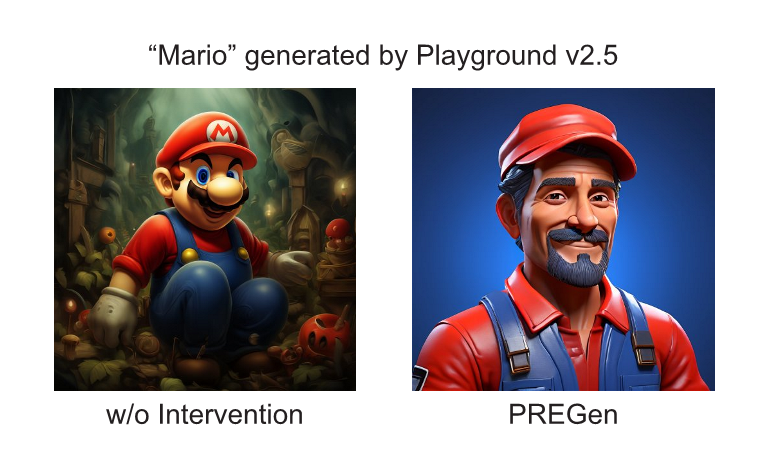

# Tackling GenAI Copyright Issues: Originality Estimation and Genericization

This repository contains code to implement PREGen (Prompt Rewriting-Enhanced Genericization) presented in "[Tackling GenAI Copyright Issues: Originality Estimation and Genericization](https://arxiv.org/abs/2406.03341)" by [Hiroaki Chiba-Okabe](https://hirochok.github.io/)<sup>†</sup> and [Weijie J. Su](http://stat.wharton.upenn.edu/~suw/).<sup>†</sup>

<sup>†</sup>University of Pennsylvania

## PREGen

PREGen is an algorithm to mitigate copyright infringement risks by genericizing the output of generative models. As an illustration of how this works, images generated by [Playground v2.5](https://huggingface.co/playgroundai/playground-v2.5-1024px-aesthetic) using the prompt "Mario" without any intervention and with PREGen are shown below.

<p align="center">
  
</p>

## How to use

Clone this repository using git.

```bash
git clone https://github.com/hirochok/PREGen.git
cd PREGen
```

Install all required packages using pip.

```bash
pip install -r requirements.txt
```

Run the main file.

```bash
python main.py --api_key "Your OpenAI API key" --input_prompt "Mario" \
--keywords_csv_path "path/50keywords_laion2b_top5.csv" --image_output_dir "path" \
--final_output_dir "path" --iterations 5 --batches 2
```

* The code uses Playground v2.5 as the text-to-image generative model and CLIP as the distance metric.
* Generation using the names of copyrighted character (i.e. direct anchors) in the COPYCAT list as the input prompt is supported.
* As the negative prompt, we use the character name and 5 CO-OCCURRENCE-LAION keywords, which can be found on the [COPYCAT repository](https://github.com/princeton-nlp/CopyCat). Specify the path of the negative prompt list as keywords_csv_path.
* Iterations and batches correspond to parameter n and b in the algorithm.
* The images produced internally by the algorithm will be saved in image_output_dir and the final output will be saved in final_output_dir.

## Prompts for evaluating performance

In the paper, we evaluate the performance of PREGen on COPYCAT. The direct and indirect anchors (names of copyrighted charcyers and their 50-word descriptions, respectively) used in the experiment can be found in this repository. 

## Citation

Please see the citation information below for citing this work:

```bibtex
@article{chibaokabe2024tackling,
  title={Tackling GenAI Copyright Issues: Originality Estimation and Genericization},
  author={Hiroaki Chiba-Okabe and Weijie J. Su},
  journal={arXiv preprint arXiv:2406.03341},
  year={2024}
}
